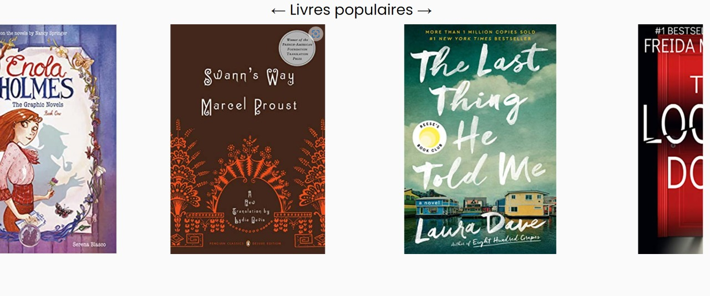
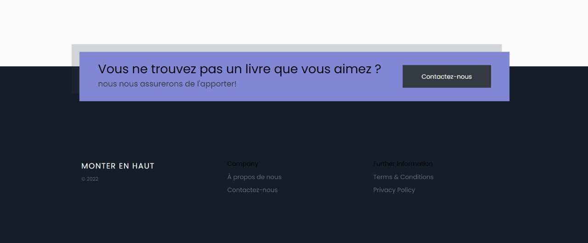
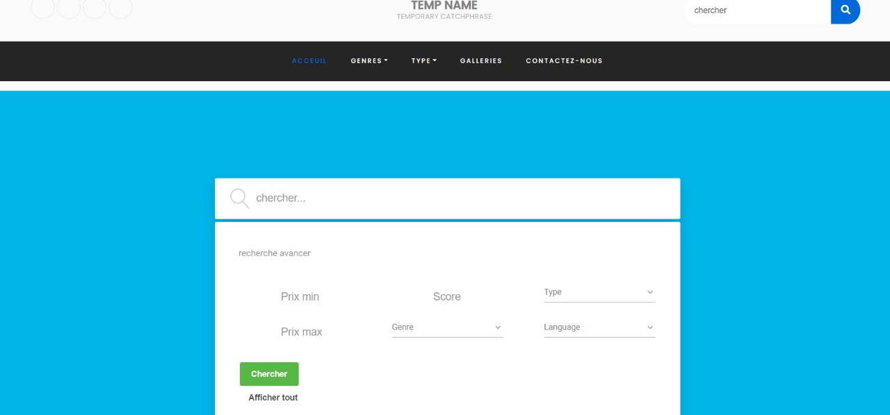
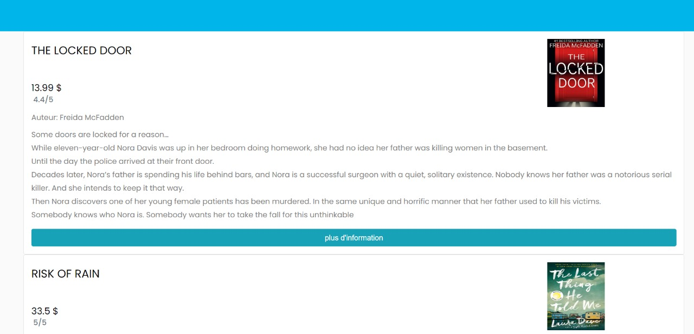
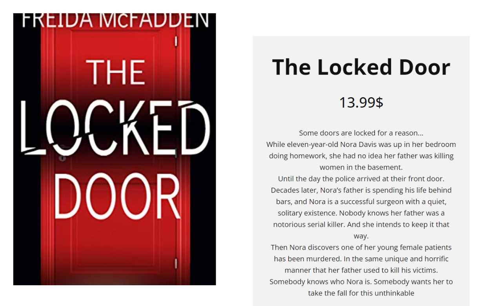
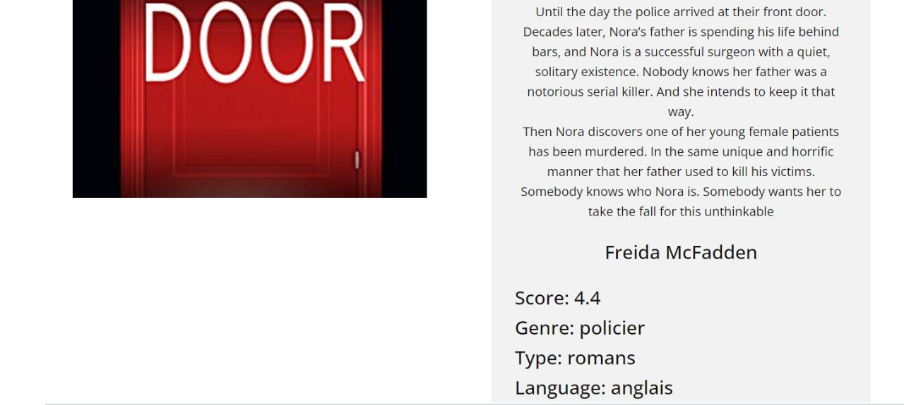
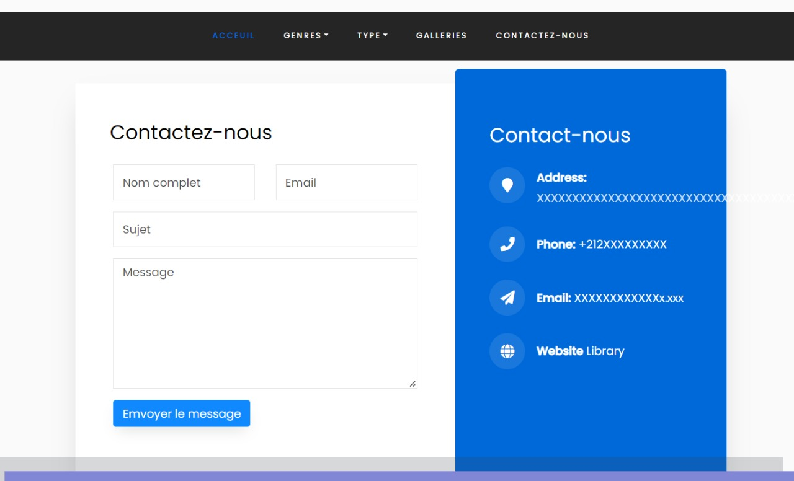
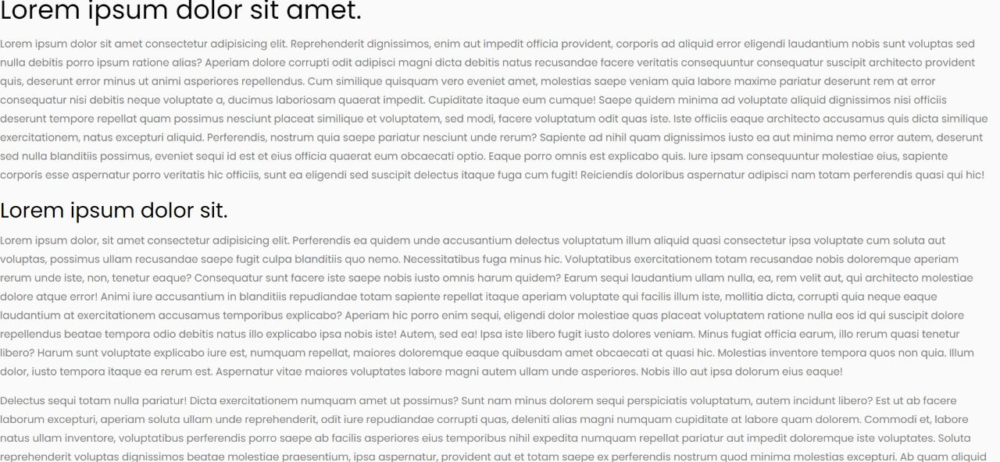

# Online-library
This web application allows the library to advertise her books and show what books are popular this moment, it also contains an advanced search option that allows the client to search for a wanted book with precision and give him information about it, and if the client cant find a book he can always use the "contact us" option to let the library know abt a book it can add to its list, finally the "about us" page will contain all information about the library and all its won prices.
## Landing page
This page offer many option lke search a book by his name or his author, also it present the most popular book to encourage people to read.

## Gallery
This page help people to find the book that they want to read about, and it allows the user to select the desired criteria provided in the book like gender, type, language and price.

## Book detail
This page provides a summary of the book.

## Contact us
This page allows the user to communicate with the library either to express their opinion on the application or to give some suggestion on desired books.

## About

## Installation
You should import library.sql on your php my admin, i use wamp server
